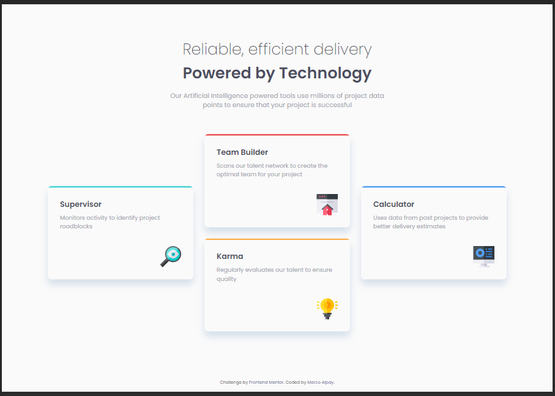
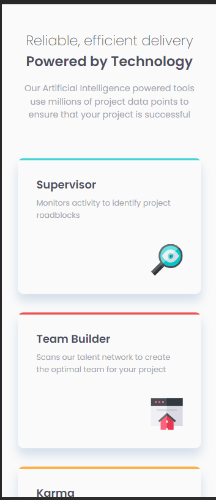
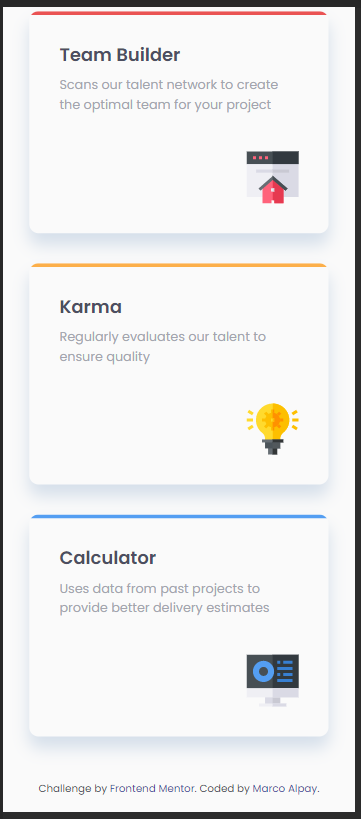

# Frontend Mentor - Four card feature section solution

This is a solution to the [Four card feature section challenge on Frontend Mentor](https://www.frontendmentor.io/challenges/four-card-feature-section-weK1eFYK). Frontend Mentor challenges help you improve your coding skills by building realistic projects.

## Table of contents

- [Overview](#overview)
  - [The challenge](#the-challenge)
  - [Screenshot](#screenshot)
  - [Links](#links)
- [My process](#my-process)
  - [Built with](#built-with)
  - [What I learned](#what-i-learned)
- [Author](#author)

## Overview

### The challenge

Users should be able to:

- View the optimal layout for the site depending on their device's screen size

### Screenshot





### Links

- Solution URL: [https://www.frontendmentor.io/solutions/four-card-feature-using-sass-l1QdfUZMS](https://www.frontendmentor.io/solutions/four-card-feature-using-sass-l1QdfUZMS)
- Live Site URL: [https://devmarco02-four-card-feature.netlify.app/](https://devmarco02-four-card-feature.netlify.app/)

## My process

### Built with

- Semantic HTML5 markup
- Sass
- Flexbox
- CSS Grid
- Mobile-first workflow

### What I learned

I have learned how to properly positioned the cards using grid.

```css
@media screen and (min-width: 800px) {
  &--supervisor,
  &--calculator {
    grid-row: 2/4;
  }

  &--team-builder {
    grid-row: 1/3;
  }

  &--karma {
    grid-row: 3/5;
  }
}
```

## Author

- Frontend Mentor - [@devMarco02](https://www.frontendmentor.io/profile/devMarco02)
